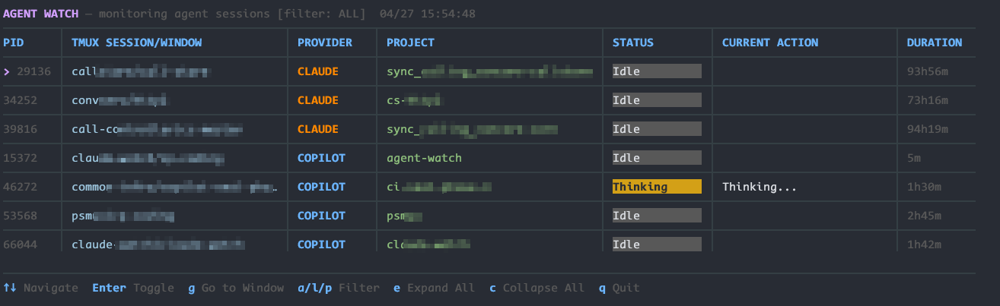

# agent-watch

A zero-setup CLI dashboard for monitoring Claude Code and GitHub Copilot CLI agents in real time.

Run `agent-watch` and instantly see what all your running sessions are doing -- which project, current action, status, and how long they've been running. Designed to live in a tmux/psmux pane as your agent task manager.



## How it works

agent-watch discovers running agent processes from the OS process list, matches each to its most recent session transcript, and renders a continuously-updating dashboard.

No hooks to configure, no agents to register, no setup. It discovers running processes and reads what's already on disk.

## Prerequisites

Install Go 1.21 or later:

```bash
# macOS
brew install go

# Windows
winget install GoLang.Go

# Linux (Debian/Ubuntu)
sudo apt install golang-go

# Linux (Fedora)
sudo dnf install golang
```

## Installation

```bash
go install github.com/tarikguney/agent-watch@latest
```

## Usage

```bash
# Just run it
agent-watch

# Select provider (default: all)
agent-watch --provider all
agent-watch --provider claude
agent-watch --provider copilot

# Custom refresh interval
agent-watch --refresh 1s

# Custom Claude directory
agent-watch --claude-dir /path/to/.claude

# Custom Copilot directory
agent-watch --provider copilot --copilot-dir /path/to/.copilot

# Compact mode for narrow tmux panes
agent-watch --compact
```

## Keyboard shortcuts

| Key | Action |
|---|---|
| `↑` / `↓` (or `k` / `j`) | Move the cursor between sessions |
| `Enter` / `Space` | Toggle expansion for the selected session (show last prompt + response) |
| `a` / `l` / `p` | Filter view to all / Claude / Copilot sessions |
| `e` | Expand all rows |
| `c` | Collapse all rows |
| `g` | Go to the session's tmux/psmux window (jumps the active client) |
| `q` / `Ctrl+C` | Quit |

## Dashboard columns

- **PID** — the OS process ID of the running process. A `>` marker highlights the cursor.
- **TMUX SESSION/WINDOW** — the `session/window` name when the session is running inside tmux, psmux, or pmux. Hidden automatically when no session is in a multiplexer.
- **PROVIDER** — `CLAUDE` or `COPILOT`, shown as a badge for each row.
- **PROJECT** — the project name derived from the session's working directory.
- **STATUS** — what the agent is doing right now (see below).
- **CURRENT ACTION** — the active tool call or a human-readable description of the current phase.
- **DURATION** — elapsed time since the session started.

When a row is expanded, two extra lines appear beneath it:

- `» prompt:` — the most recent user prompt (or the original task if no new prompt has been sent).
- `» response:` — the latest response text from the agent.

## Status indicators

| Status | Meaning |
|---|---|
| **Thinking** | The agent is in an extended-thinking block |
| **Tool Use** | A tool call is in flight (the tool name shows in *Current Action*) |
| **Streaming** | Claude is streaming a response token by token |
| **Responding** | The agent is actively producing a reply (generic working state) |
| **Waiting** | Process is up but the session has not received its first prompt yet |
| **Idle** | Process is running and Claude is waiting for user input |
| **Interrupted** | The last turn was cancelled by the user |
| **Done** | Session completed normally |
| **Error** | The last tool call returned an error |

## tmux / psmux integration

agent-watch detects tmux, psmux, and pmux automatically (set `CLAUDE_WATCH_TMUX_BIN` to override). When a session process lives inside a multiplexer pane, the dashboard shows its `session/window` name and lets you jump straight to it with `g`. If programmatic switching fails (e.g. you're attached from a different client), the status bar prints the manual `Ctrl+B, s` navigation hint for that session.

## Platform support

Works on Windows, macOS, and Linux. Process discovery uses:
- **Windows**: PowerShell (`Get-CimInstance Win32_Process`)
- **macOS/Linux**: `ps` with command-line flag parsing

## License

MIT
